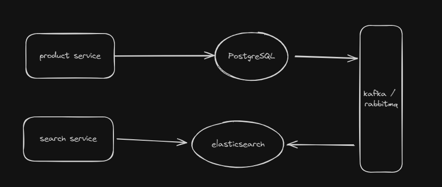

# Introduction
Repository ini akan membuat sebuah aplikasi search menggunakan elasticsearch dengan data yang akan disynchronize dari database postgresql. Aplikasi ini juga akan menggunakan message broker untuk mengirimkan data yang disimpan, diupdate, dan dihapus dari database postgresql ke elasticsearch. Aplikasi ini akan memiliki 2 service yaitu:
1. Product Service
2. Search Service

# Tech Stack
Tech stack yang digunakan dalam aplikasi ini adalah:
1. Golang
2. Elasticsearch
3. Postgresql
4. RabbitMQ atau Kafka (Pilih salah satu)
5. Docker
6. Docker Compose
7. Makefile

# Flow

